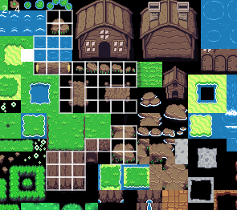

# Solarus tileset importer

This tools allow you to quickly import a tileset into [Solarus engine](http://www.solarus-games.org/). This tools requires [LÖVE](https://love2d.org/).

## Usage

1. Load your tileset image: `love solarus-tileset-importer <your-tileset.png> <tile-width> <tile-height>`
2. All the tiles are traversable by default. Click on the tiles to you want to turn into walls.
3. Press any key to output your tileset.dat file to stdout.
